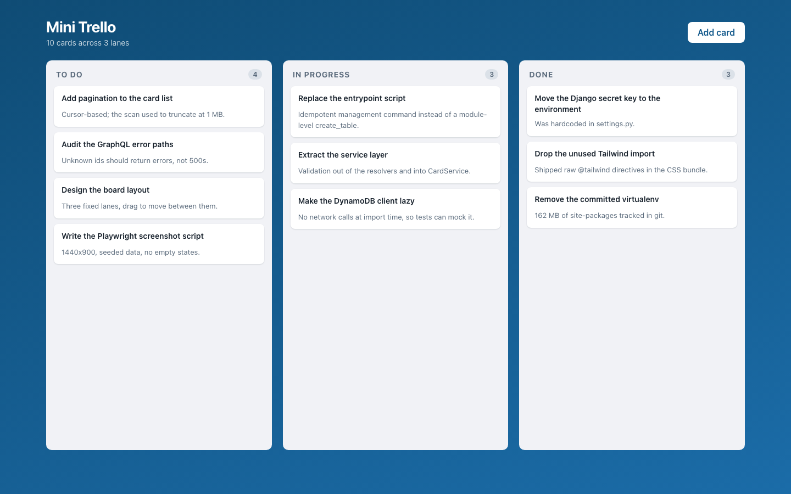
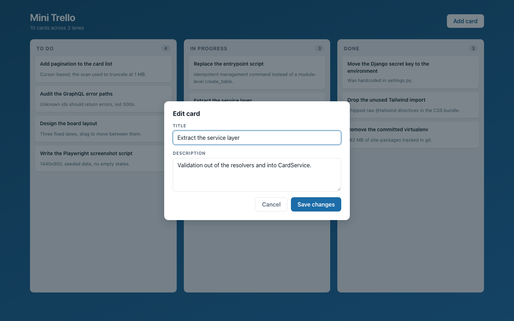
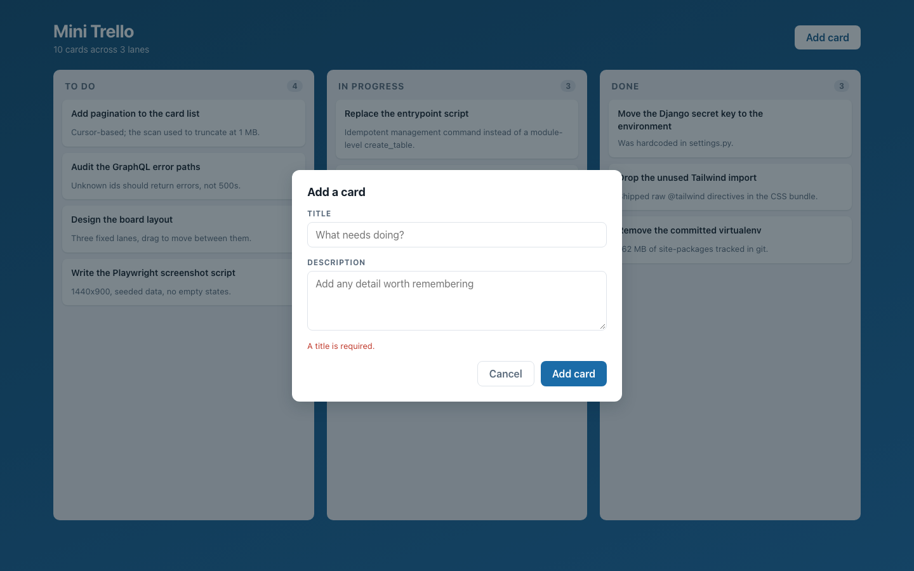
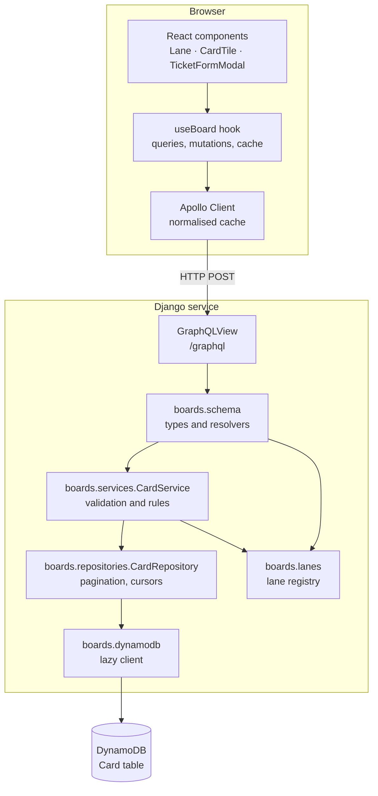
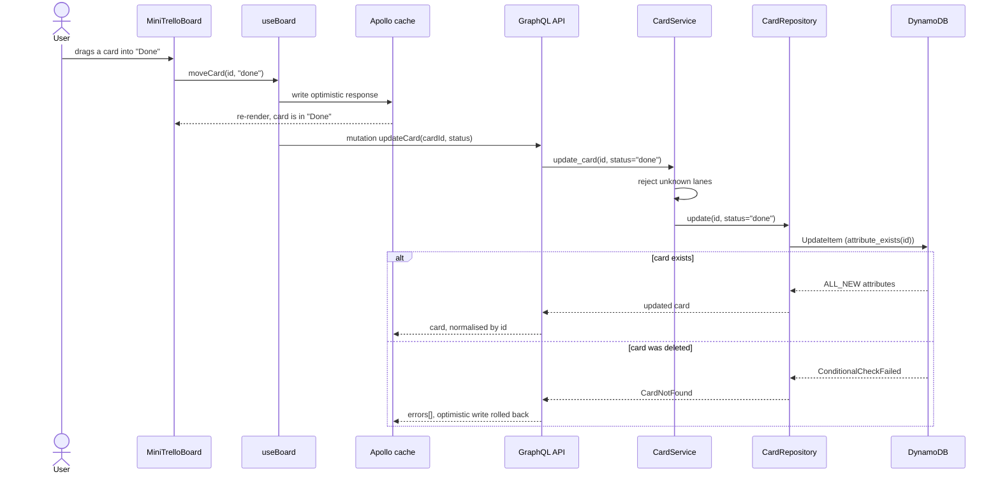

# Mini Trello

A small kanban board: three lanes, cards you can create, edit, delete and drag
between lanes. The frontend is React talking to a Django GraphQL API, and cards
are stored in DynamoDB rather than a relational database.

It is a single global board with no accounts and no login — see
[Limitations](#limitations).

## Screenshots

A seeded board at 1440x900:



Editing a card:



Validation before anything is sent to the server:



Real request/response pairs against a running backend are in
[docs/api-examples.md](docs/api-examples.md).

## Architecture

The backend is layered, and dependencies only point inward: the GraphQL layer
knows about services, services know about repositories, and only the repository
knows that the store is DynamoDB. Swapping the store means replacing one class.



## Workflow

Moving a card between lanes, from drag to persisted write:



## Quickstart

With Docker:

```bash
cp mini_trello_be/.env.example mini_trello_be/.env   # optional; compose has defaults
docker compose up --build
```

Then open <http://localhost:3000>. The API is on <http://localhost:8001/graphql>.

To seed the board with demo cards:

```bash
docker compose exec backend python manage.py seed_board
```

### Running without Docker

DynamoDB Local normally comes from the compose stack. Without it, `moto` (already
a dev dependency) serves an API-compatible DynamoDB in a local process:

```bash
# 1. DynamoDB on :8000
cd mini_trello_be
python -m venv .venv && source .venv/bin/activate
pip install -r requirements-dev.txt
moto_server -p 8000 &

# 2. API on :8001
export DYNAMODB_ENDPOINT_URL=http://localhost:8000
export AWS_ACCESS_KEY_ID=local AWS_SECRET_ACCESS_KEY=local AWS_DEFAULT_REGION=us-west-2
python manage.py migrate          # Django's own tables
python manage.py init_dynamodb    # creates the Card table; safe to re-run
python manage.py seed_board       # demo cards
python manage.py runserver 0.0.0.0:8001 &

# 3. UI on :3000
cd ../mini_trello_fe
npm ci
REACT_APP_GRAPHQL_URL=http://localhost:8001/graphql npm start
```

## Configuration

### Backend (`mini_trello_be/.env`)

| Variable | Required | Default | Purpose |
| --- | --- | --- | --- |
| `DJANGO_SECRET_KEY` | Yes when `DJANGO_DEBUG` is off | *(insecure dev key)* | Django signing key. Startup fails if it is missing with debug off. |
| `DJANGO_DEBUG` | No | `true` | Django debug mode. Turn off outside development. |
| `DJANGO_ALLOWED_HOSTS` | No | `localhost,127.0.0.1,0.0.0.0` | Comma-separated hosts Django will serve. |
| `DJANGO_DB_PATH` | No | `<backend>/db.sqlite3` | SQLite file for Django's own tables (sessions, auth, admin). Cards do not live here. |
| `CORS_ALLOWED_ORIGINS` | No | `http://localhost:3000` | Comma-separated origins allowed to call the API. |
| `GRAPHIQL_ENABLED` | No | follows `DJANGO_DEBUG` | Serves the in-browser GraphiQL explorer at `/graphql`. |
| `LOG_LEVEL` | No | `INFO` | Root and application log level. |
| `DYNAMODB_ENDPOINT_URL` | No | *(empty — real AWS)* | Point at DynamoDB Local or moto. Empty means real DynamoDB. |
| `DYNAMODB_CARD_TABLE` | No | `Card` | Name of the table holding cards. |
| `AWS_DEFAULT_REGION` | No | `us-west-2` | AWS region for the DynamoDB client. |
| `AWS_ACCESS_KEY_ID` | No | *(unset)* | Required by boto3. DynamoDB Local ignores the value but needs one set. |
| `AWS_SECRET_ACCESS_KEY` | No | *(unset)* | As above. |

### Frontend (`mini_trello_fe/.env.local`)

| Variable | Required | Default | Purpose |
| --- | --- | --- | --- |
| `REACT_APP_GRAPHQL_URL` | No | `http://localhost:8001/graphql` | API endpoint. Create React App inlines this at **build** time, so a change needs a rebuild. |
| `PORT` | No | `3000` | Port for the dev server. |

## Development

```bash
# Backend tests (no AWS, no network, no Docker — moto mocks DynamoDB)
cd mini_trello_be && pytest

# Backend lint and format
ruff check . && ruff format --check .

# Frontend tests
cd mini_trello_fe && npm run test:ci

# Frontend lint
npm run lint

# Regenerate the README screenshots against a running stack
APP_URL=http://localhost:3000 npx playwright test -c screenshots.config.js
```

## Project structure

```
.
├── docker-compose.yml           # frontend + backend + DynamoDB Local
├── docs/
│   ├── api-examples.md          # captured request/response pairs
│   └── screenshots/             # README images, generated by Playwright
├── mini_trello_be/              # Django + Graphene API
│   ├── boards/
│   │   ├── dynamodb.py          # lazy, env-driven boto3 client
│   │   ├── lanes.py             # the lane registry — the extension seam
│   │   ├── repositories.py      # DynamoDB data access, cursor pagination
│   │   ├── services.py          # validation and business rules
│   │   ├── schema.py            # GraphQL types and resolvers
│   │   ├── management/commands/ # init_dynamodb, seed_board
│   │   └── tests/               # pytest suite, moto-backed
│   ├── mini_trello_be/          # settings, urls, root schema
│   └── entrypoint.sh            # migrate + create table, then run
└── mini_trello_fe/              # React single-page app
    ├── e2e/                     # Playwright screenshot script
    ├── nginx.conf               # serves the production build
    └── src/
        ├── Components/          # Lane, CardTile, TicketFormModal
        ├── Pages/               # MiniTrelloBoard — rendering only
        ├── graphql/             # queries and mutations
        ├── hooks/useBoard.js    # all board data handling
        └── __tests__/           # React Testing Library suite
```

## Design notes

**Layering.** The API follows a repository/service split. `schema.py` maps
arguments onto service calls and maps domain exceptions onto GraphQL errors;
`services.py` holds validation; `repositories.py` is the only module that
composes DynamoDB expressions. Resolvers previously indexed dictionaries
straight from `scan()`, so a malformed row or a missing id surfaced as a 500.

**The lane registry is the extension seam.** `boards/lanes.py` is the single
source of truth for what a status may be. Validation, the `lanes` GraphQL
query and the seed command all read from it, and the frontend renders whatever
lanes the API reports. Adding a "Blocked" column is one tuple entry and no
frontend change at all. Statuses are not hardcoded anywhere else.

**The connection is lazy.** The data layer used to build a boto3 resource and a
table handle at import time, pointed at the hostname `dynamodb`. That made the
module impossible to import outside a compose network, which is a large part of
why the project had no tests. The client is now built on first use from
environment variables and can be reset, which is what lets the suite point the
whole application at an in-process mock.

**Pagination is the real scalability fix.** Listing cards called `scan()` once
and returned `response["Items"]`. DynamoDB caps a scan response at 1 MB and
reports the cut-off in `LastEvaluatedKey`, which the code ignored — so past
roughly 1 MB of cards, the board silently stopped showing them, with no error
anywhere. `CardRepository.list` now follows the cursor, caps a page at 200
items so no caller can request an unbounded read, and returns an opaque cursor;
`cardPage` exposes it over GraphQL. A `ProjectionExpression` keeps the read to
the six attributes the API actually exposes.

The honest limit of that fix: rendering the whole board is still O(table),
because a single global board means every card is in scope. The next step is
not an index on `status` — with three lanes that is a low-cardinality hot
partition that reads the same items anyway — but a `board_id` partition key, so
a query reads one board instead of scanning all of them. That change belongs
with the introduction of accounts.

**Writes are conditional.** Updates and deletes carry
`ConditionExpression="attribute_exists(id)"`, so acting on a card someone else
just deleted returns a clear error instead of silently resurrecting it. Update
uses `ReturnValues="ALL_NEW"`, removing a second round trip the original made to
re-read what it had just written.

**Framework versions.** The stack is pinned to Django 3.2 and graphene-django 2
because graphene-django 2 does not support Django 4. Django 3.2 is past end of
life, so the upgrade to graphene-django 3 and Django 4.2 LTS is the first piece
of maintenance this project needs. It was deliberately not bundled into this
pass.

## Limitations

- **No authentication and no multi-tenancy.** There is no user model, no login
  and no owner on a card. Every caller reads and writes the same global board.
  This is pinned by tests in `boards/tests/test_security.py` so the gap stays
  visible rather than being assumed away. Do not deploy this to the internet as
  it stands.
- **Card order within a lane is not persisted.** Cards have no position
  attribute, so dragging within a lane is a no-op and cards render in whatever
  order DynamoDB returns. Dragging *between* lanes does persist.
- **Only three lanes**, defined in code rather than created by users.
- **The frontend fetches the whole board in one query.** The API supports
  cursor pagination (`cardPage`); the UI does not use it yet, so a very large
  board will fetch up to the page cap and stop.
- **`REACT_APP_GRAPHQL_URL` is baked in at build time**, a Create React App
  constraint. One image cannot be promoted across environments unchanged.
- **Create React App is unmaintained.** A move to Vite is worth doing alongside
  the Django upgrade.
- **No CI pipeline** is committed; the test and lint commands above are meant to
  be wired into one.
