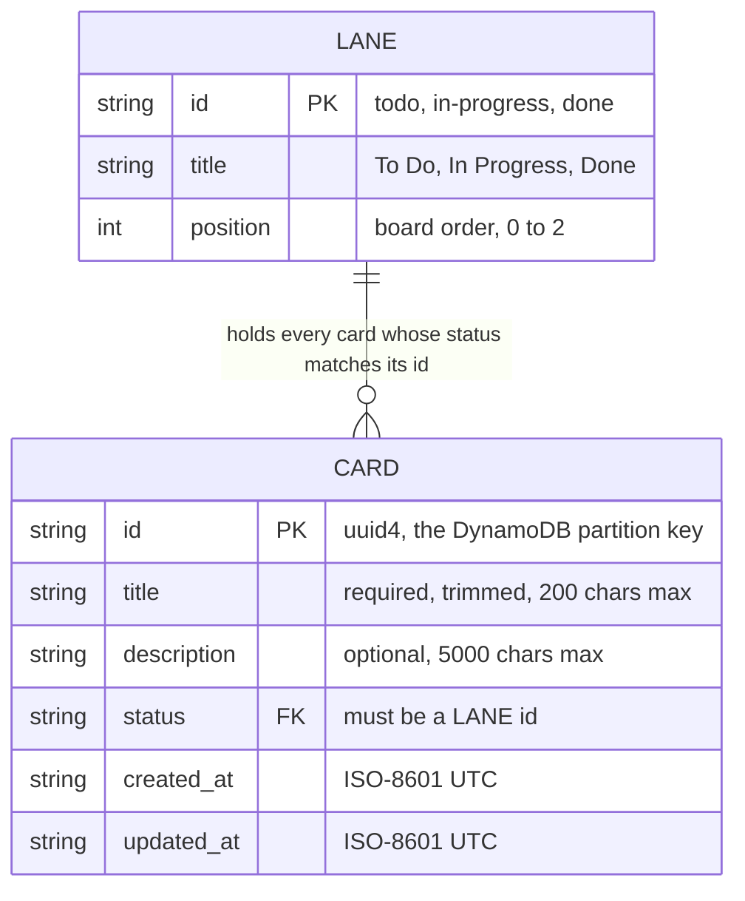
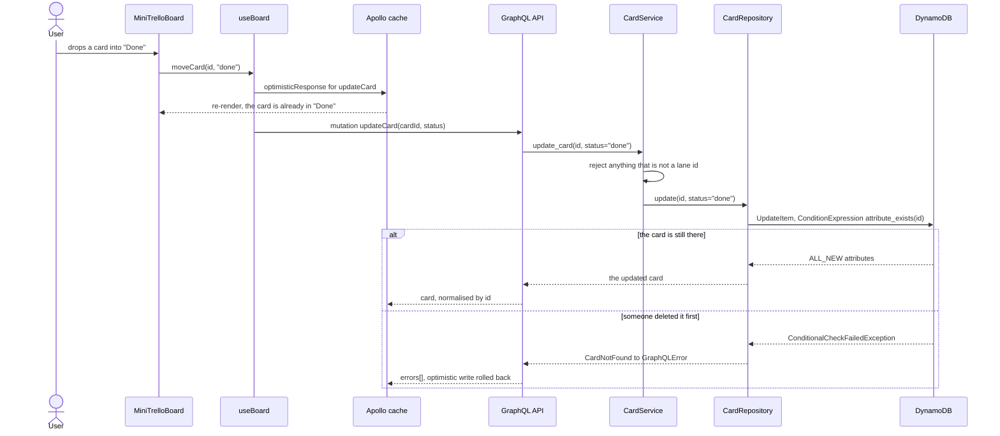

# Mini Trello

Three lanes and cards you drag between them. A React single-page app talks to a
Django + Graphene GraphQL API, and the cards live in DynamoDB rather than in a
relational database.

It is one global board: no accounts, no login, no per-user anything — see
[Known gaps](#known-gaps).

## The board

Ten seeded cards, captured at 1440x900 against the running stack:


A card opens pre-filled for editing:


The form refuses an empty title before anything reaches the server:


Literal request/response pairs against a live backend — the error paths
included — are in [docs/api-examples.md](docs/api-examples.md).

## Getting it running

### With Docker

```bash
docker compose up --build
docker compose exec backend python manage.py seed_board   # optional demo cards
```

The UI lands on <http://localhost:3000> and GraphQL on
<http://localhost:8001/graphql>. All three host ports are overridable, so the
stack can sit beside other projects:

```bash
FRONTEND_PORT=4000 BACKEND_PORT=4001 DYNAMODB_PORT=4002 docker compose up
```

Status, stated plainly: `docker compose config` parses, but the images have not
been built or booted in this environment. Treat the compose path as unverified
and the path below as the one that has actually been exercised.

### Without Docker

`moto` — already a dev dependency — serves an API-compatible DynamoDB in a local
process, so the whole thing runs with no AWS account and no containers. This is
the setup `docs/api-examples.md` and the screenshots above were captured against.

```bash
# 1. DynamoDB stand-in on :8000
cd mini_trello_be
python -m venv .venv && source .venv/bin/activate
pip install -r requirements-dev.txt
moto_server -p 8000 &

# 2. API on :8001
export DYNAMODB_ENDPOINT_URL=http://localhost:8000
export AWS_ACCESS_KEY_ID=local AWS_SECRET_ACCESS_KEY=local AWS_DEFAULT_REGION=us-west-2
python manage.py migrate          # Django's own tables, not the cards
python manage.py init_dynamodb    # creates the Card table; safe to re-run
python manage.py seed_board       # demo cards
python manage.py runserver 0.0.0.0:8001 &

# 3. UI on :3000
cd ../mini_trello_fe
npm ci
REACT_APP_GRAPHQL_URL=http://localhost:8001/graphql npm start
```

`init_dynamodb` is idempotent on purpose: it catches `ResourceInUseException`
and reports "already exists", which is also what makes the container entrypoint
safe to re-run.

## What a card is

One table holds everything. `Card` has `id` as its partition key, no sort key,
no secondary index, and there is no second table anywhere.

Lanes are not rows. `boards/lanes.py` holds a frozen tuple of three `Lane`
dataclasses, and that tuple is the only definition of what a `status` may be.
Validation reads it, the `lanes` GraphQL query serves it, `seed_board` uses it,
and the React board renders whatever lanes the API reports. A card's `status` is
a foreign key into code, not into a table.

There is no board entity either. Every card belongs to the single global board.



The length limits are enforced by `CardService`, not by DynamoDB, and both
boundaries are covered in `boards/tests/test_services.py`. Reads use a
`ProjectionExpression` over exactly those six attributes, so a board read never
pulls back anything the API does not expose.

## Dragging a card to another lane

A move is a validated status change and nothing more. The cache is written
optimistically so the card does not snap back while the mutation is in flight,
and Apollo rolls that write back if the server rejects it.



`handleDragEnd` returns early for a drop back into the same lane, so reordering
within a lane never reaches the API. There is nowhere to persist it to — see
[Known gaps](#known-gaps).

## Why it is built this way

**Dependencies point inward.** `schema.py` maps GraphQL arguments onto service
calls and domain exceptions onto `GraphQLError`; `services.py` holds validation
and defaults; `repositories.py` is the only module that composes a DynamoDB
expression; `dynamodb.py` is the only one that knows a connection exists.
Swapping the store means writing one new class, because `CardService` takes its
repository by constructor injection.

**Adding a lane is a one-line change.** Drop a `Lane` into the tuple in
`boards/lanes.py` and it is valid input, it appears in the `lanes` query, and
the frontend renders a fourth column with no frontend change at all.
`test_every_declared_lane_is_accepted` is parametrised over the registry, so a
new lane is covered the moment it is added.

**The connection is lazy and resettable.** `boards/dynamodb.py` builds the boto3
resource on first use, behind a lock, from environment variables, and
`reset_connection()` drops it. Nothing touches the network at import time, which
is what lets the suite point the entire application at an in-process mock —
pinned by `test_the_dynamodb_client_is_built_lazily`.

**Listing follows the cursor.** DynamoDB caps a scan response at 1 MB and
reports the cut-off in `LastEvaluatedKey`. `CardRepository.list` walks that key
until the page is full, caps a page at 200 items so no caller can ask for an
unbounded read, and returns an opaque cursor that `cardPage` exposes over
GraphQL. A malformed cursor restarts the listing rather than failing the
request. `TestTruncationRegression::test_list_follows_last_evaluated_key_instead_of_truncating`
drives a table double that returns one item per scan, so a single-call
implementation fails it.

The honest limit: rendering the board is still O(table), because one global
board means every card is in scope. The next step is not an index on `status` —
three lanes is a low-cardinality hot partition that reads the same items anyway
— but a `board_id` partition key, which only makes sense alongside accounts.

**Writes are conditional.** Update and delete both carry
`ConditionExpression="attribute_exists(id)"`, so acting on a card someone else
just removed returns a clear error instead of silently resurrecting it, and
`deleteCard` reports `success: false` for an id that was never there
(`test_delete_of_a_missing_card_reports_failure`). Update uses
`ReturnValues="ALL_NEW"`, so an edit is one round trip, not a write followed by
a re-read.

**The framework pins are deliberate and temporary.** Django is held at 3.2 and
graphene-django at 2.16 because graphene-django 2 does not support Django 4.
Django 3.2 is past end of life, so moving to graphene-django 3 and Django 4.2
LTS is the first maintenance this project needs.

## Known gaps

- **No authentication and no multi-tenancy.** No user model, no login mutation,
  no owner attribute on a card. Every caller reads and writes the same board.
  `boards/tests/test_security.py` characterises this deliberately — an
  unauthenticated caller can read and delete anything, and the schema exposes no
  user, login, token or auth field — so the gap has to be changed on purpose
  rather than assumed away. Do not put this on the internet as it stands.
- **Card order within a lane is not persisted.** Cards carry no position
  attribute, so they render in whatever order DynamoDB returns them. Dragging
  *between* lanes does persist.
- **Three lanes, defined in code.** Users cannot create or rename a column.
- **The UI fetches the whole board in one query.** The API supports cursor
  pagination via `cardPage`; the board uses `allCards` and stops at the page cap.
- **`REACT_APP_GRAPHQL_URL` is baked in at build time.** A Create React App
  constraint: one image cannot be promoted across environments unchanged.
- **Create React App is unmaintained.** A move to Vite belongs with the Django
  upgrade.
- **No CI pipeline is committed.** The commands below are what one would run.

## Reference

### Commands

```bash
# Backend suite: pytest + moto, no network, no AWS, no Docker
cd mini_trello_be && pytest                 # 72 tests

# Backend lint and format
ruff check . && ruff format --check .

# Frontend suite: React Testing Library + Apollo MockedProvider
cd mini_trello_fe && npm run test:ci        # 16 tests

# Frontend lint
npm run lint

# Regenerate the screenshots above against a running stack
APP_URL=http://localhost:3000 npx playwright test -c screenshots.config.js
```

### Environment variables

Backend, read from the process environment or `mini_trello_be/.env`:

| Variable | Default | Purpose |
| --- | --- | --- |
| `DJANGO_SECRET_KEY` | *(insecure dev key)* | Django signing key. Startup **fails** when `DJANGO_DEBUG` is off and this is unset. |
| `DJANGO_DEBUG` | `true` | Django debug mode. |
| `DJANGO_ALLOWED_HOSTS` | `localhost,127.0.0.1,0.0.0.0` | Comma-separated hosts Django will serve. |
| `DJANGO_DB_PATH` | `<backend>/db.sqlite3` | SQLite file for Django's own tables — sessions, auth, admin. Cards are not in here. |
| `CORS_ALLOWED_ORIGINS` | `http://localhost:3000` | Comma-separated origins allowed to call the API. |
| `GRAPHIQL_ENABLED` | follows `DJANGO_DEBUG` | Serves the in-browser GraphiQL explorer at `/graphql`. |
| `LOG_LEVEL` | `INFO` | Root and `boards` log level. |
| `DYNAMODB_ENDPOINT_URL` | *(empty — real AWS)* | Point at DynamoDB Local or moto. |
| `DYNAMODB_CARD_TABLE` | `Card` | Name of the table holding cards. |
| `AWS_DEFAULT_REGION` | `us-west-2` | Region for the DynamoDB client. |
| `AWS_ACCESS_KEY_ID` / `AWS_SECRET_ACCESS_KEY` | *(unset)* | boto3 requires both to be set. DynamoDB Local ignores the values. |

Frontend, read from `mini_trello_fe/.env.local` at **build** time:

| Variable | Default | Purpose |
| --- | --- | --- |
| `REACT_APP_GRAPHQL_URL` | `http://localhost:8001/graphql` | API endpoint. Changing it needs a rebuild. |
| `PORT` | `3000` | Port for the CRA dev server. |

### Repository layout

```
.
├── docker-compose.yml           # frontend + backend + DynamoDB Local
├── docs/
│   ├── api-examples.md          # captured request/response pairs
│   └── screenshots/             # the three images above, made by Playwright
├── mini_trello_be/              # Django + Graphene API
│   ├── boards/
│   │   ├── lanes.py             # the lane registry — the extension seam
│   │   ├── services.py          # validation and business rules
│   │   ├── repositories.py      # DynamoDB access, cursor pagination
│   │   ├── dynamodb.py          # lazy, env-driven boto3 client
│   │   ├── schema.py            # GraphQL types and resolvers
│   │   ├── management/commands/ # init_dynamodb, seed_board
│   │   └── tests/               # pytest suite, moto-backed
│   ├── mini_trello_be/          # settings, urls, root schema
│   └── entrypoint.sh            # migrate + create table, then run
└── mini_trello_fe/              # React single-page app
    ├── e2e/                     # Playwright screenshot script
    ├── nginx.conf               # serves the production build
    └── src/
        ├── Components/          # Lane, CardTile, TicketFormModal
        ├── Pages/               # MiniTrelloBoard — rendering only
        ├── graphql/             # queries and mutations
        ├── hooks/useBoard.js    # all board data handling
        └── __tests__/           # React Testing Library suite
```
